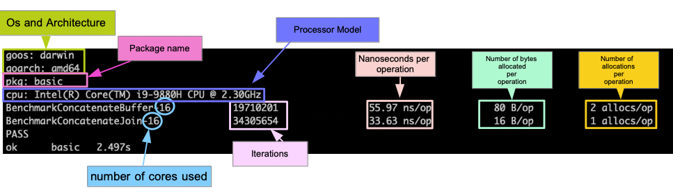

### CMS DBS use-case

Build package:
```
# (optional): if there is no go.mod and go.sum you will do
go mod init web
go mod tidy

# and build executable as simple as
go build
```

The new `web` server can be tested as following:
```
# setup DBS_URL
export DBS_URL=https://.../dbs/int/global/DBSReader

# server
./web
# or run concurrent calls
./web -action concurrent
# or run concurrent calls to process responses
./web -action concurrent_response

# client
curl "http://localhost:8888/dbs?dataset=/ZMM*"

# perform unit test
go test -v .
```

### Benchmarking our codebase

```
# run benchmark test
go test -run Benchmark -bench=.

# run comprehensive benchmark test to measure cpu/mem profile and trace out all calls
go test -run Benchmark -bench=. -benchmem -cpuprofile=cpu.out -memprofile=mem.out -trace=trace.out

# run go pprof and then use "top" command in each
go tool pprof ./web mem.out
# or use graphical interface
go tool pprof -http :8080  ./web mem.out

# the same for cpu output
go tool pprof ./web cpu.out
# or use graphical interface
go tool pprof -http :8080  ./web cpu.out

# tracer
go tool trace trace.out
```

Here is how you should read the benchmark results


### References
- [Go benchmarks](https://www.practical-go-lessons.com/chap-34-benchmarks)
- [practical command](https://gist.github.com/arsham/bbc93990d8e5c9b54128a3d88901ab90)
